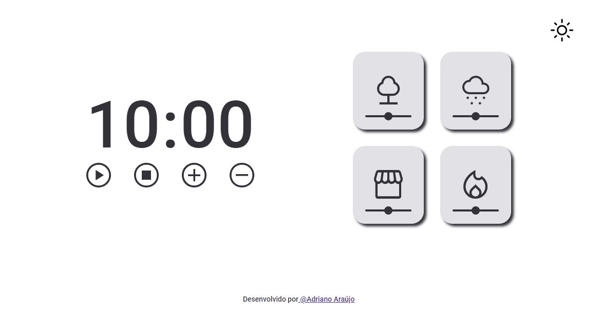

# ⌛ Focus Timer

Segundo desafio proposto no módulo 5 do curso Explorer da Rocketseat

 
 

## ⚙️ Funcionalidades

- Temporizador
- Tocar som relaxante (cards que se encontra ao lado direito)
- Para iniciar o som de um card, tem que parar o som do card anterior
- Opção do botão mode dark

 
 

## 🚀 Esse projeto foi desenvolvido com as seguintes tecnologias: 

- HTML
- CSS
- Javascript
- DOM
- GIT
- GITHUB
 
 

## Demostração 

 

  
  

 

Link para acessar :  <a href= "https://adriannoarraujo.github.io/Focus-Timer-/" target="_blank"> Focus Timer </a> 

 

Desenvolvido por<a  href="https://adriannoarraujo.github.io/Contacts-Links/" target="_blank">@Adriano Araújo </a>

